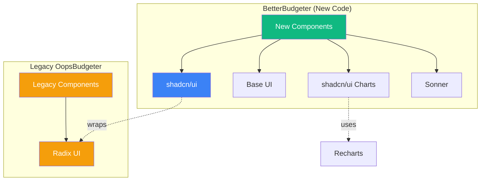

<objective>
Create comprehensive UI library documentation that helps junior developers understand the library architecture.

Purpose: Establish docs/UI_ARCHITECTURE.md as the central reference for UI library responsibilities, including Mermaid diagrams and Sonner toast patterns. Add header comments to key files pointing to this documentation.

Output: A documentation file that answers "which library do I use for X?" and key files with header comments documenting their library usage.
</objective>

<execution_context>
@/Users/paulheuwer/.claude/get-shit-done/workflows/execute-plan.md
@/Users/paulheuwer/.claude/get-shit-done/templates/summary.md
</execution_context>

<context>
@.planning/PROJECT.md
@.planning/ROADMAP.md
@.planning/STATE.md
@.planning/phases/04-library-consolidation-cleanup/04-CONTEXT.md
@.planning/phases/04-library-consolidation-cleanup/04-RESEARCH.md
@.planning/phases/04-library-consolidation-cleanup/04-01-SUMMARY.md
@CLAUDE.md
</context>

<tasks>

<task type="auto">
  <name>Task 1: Create docs/UI_ARCHITECTURE.md</name>
  <files>docs/UI_ARCHITECTURE.md</files>
  <action>
Create a new documentation file at `docs/UI_ARCHITECTURE.md` with the following structure:

```markdown
# UI Library Architecture

This document defines the UI library responsibilities and boundaries for BetterBudgeter.
For enforcement rules, see CLAUDE.md.

## Library Responsibilities

| Library | Scope | Status | When to Use |
|---------|-------|--------|-------------|
| shadcn/ui | All new BetterBudgeter components | ACTIVE | Default choice for new UI components |
| Base UI (@base-ui/react) | Headless primitives | AVAILABLE | When shadcn/ui lacks a needed primitive |
| Radix UI (@radix-ui/*) | Legacy OopsBudgeter only | FROZEN | Never for new code |
| Recharts (via shadcn/ui charts) | All new charts | ACTIVE | Any data visualization |
| Sonner | Toast notifications | ACTIVE | All user feedback toasts |

## Visual Architecture

[Include Mermaid diagram showing relationships - see below]

## Boundary Rules

1. **BetterBudgeter components must NEVER import from `@radix-ui` directly**
2. **Legacy OopsBudgeter pages stay on Radix only - no shadcn/ui adoption**
3. **New charts must use shadcn/ui chart components (Recharts under the hood)**
4. **Base UI is only used when shadcn/ui does not provide the needed primitive**
5. **All toast notifications use Sonner - no custom implementations**

See CLAUDE.md "UI Library Boundaries" section for enforcement.

## Chart Color System

[Document CATEGORY_COLORS usage from src/utils/charts/index.ts]

## Sonner Toast Patterns

[Document toast usage patterns with code examples]

## File Structure

[Show where each library's components live]

## Decision Log

| Date | Decision | Rationale |
|------|----------|-----------|
| 2026-01-28 | Remove Tremor entirely | Unmaintained (no commits in 1+ year) |
| 2026-01-28 | Adopt shadcn/ui as primary | Copy/paste model, actively maintained |
| 2026-01-28 | Base UI for new primitives | Modern successor to Radix, v1.0 stable |
| 2026-01-30 | Freeze Radix for legacy only | Consistency with existing legacy code |
```

**Mermaid Diagram (include in Visual Architecture section):**



**Sonner Toast Patterns section content:**

Document the established patterns from the codebase:
- Import: `import { toast } from "sonner"`
- Success: `toast.success("Message")`
- Error: `toast.error("Message")`
- Warning: `toast.warning("Message")`
- Info: `toast.info("Message")`
- With description: `toast.success("Title", { description: "Details" })`

Include the list of files that use Sonner (from research) as a reference.

**Chart Color System section content:**

Document that CATEGORY_COLORS in `src/utils/charts/index.ts` provides consistent colors for expense categories. Explain how to use it with Recharts Cell components.
  </action>
  <verify>
- File exists at docs/UI_ARCHITECTURE.md
- Contains all five library sections
- Contains Mermaid diagram (check for "```mermaid" code block)
- Contains Sonner patterns section
- Contains chart color system section
- References CLAUDE.md
  </verify>
  <done>docs/UI_ARCHITECTURE.md created with complete library documentation, Mermaid diagrams, and usage patterns</done>
</task>

<task type="auto">
  <name>Task 2: Add header comments to key files</name>
  <files>src/components/dashboard/SpendingByCategoryChart.tsx, src/components/ui/sonner.tsx</files>
  <action>
Add JSDoc-style header comments to key files that document their library usage:

**File 1: src/components/dashboard/SpendingByCategoryChart.tsx**

Add this header comment at the top of the file (after imports, before component):

```typescript
/**
 * Spending by Category Chart Component
 *
 * Displays a donut chart showing expense breakdown by category.
 * Data is transformed from transaction objects to chart-compatible format.
 *
 * LIBRARY USAGE:
 * - shadcn/ui ChartContainer for wrapper and theming
 * - Recharts PieChart for the actual visualization
 * - @/utils/charts/CATEGORY_COLORS for consistent category colors
 *
 * @see docs/UI_ARCHITECTURE.md for library decisions
 * @see docs/DASHBOARD_STRATEGY.md Section 4.2 for design rationale
 */
```

**File 2: src/components/ui/sonner.tsx**

Add/update the header comment:

```typescript
/**
 * Sonner Toaster Configuration
 *
 * This file configures the Sonner toast library for the application.
 * It's mounted in src/app/layout.tsx and provides the global toast context.
 *
 * USAGE:
 * Import `toast` from "sonner" anywhere to show notifications:
 *   toast.success("Message")
 *   toast.error("Message")
 *   toast.warning("Message")
 *   toast.info("Message")
 *
 * @see docs/UI_ARCHITECTURE.md#sonner-toast-patterns for full documentation
 */
```

Note: Read the files first to understand their current structure, then add the header comments in appropriate locations without breaking existing code.
  </action>
  <verify>
- `grep "LIBRARY USAGE" src/components/dashboard/SpendingByCategoryChart.tsx` returns match
- `grep "@see docs/UI_ARCHITECTURE.md" src/components/dashboard/SpendingByCategoryChart.tsx` returns match
- `grep "@see docs/UI_ARCHITECTURE.md" src/components/ui/sonner.tsx` returns match
- `bun run typecheck` passes (comments don't break compilation)
  </verify>
  <done>Header comments added to SpendingByCategoryChart.tsx and sonner.tsx documenting library usage</done>
</task>

</tasks>

<verification>
After all tasks complete:

1. **Documentation exists and is comprehensive:**
   ```bash
   ls -la docs/UI_ARCHITECTURE.md
   grep -c "shadcn/ui\|Base UI\|Radix\|Recharts\|Sonner" docs/UI_ARCHITECTURE.md
   ```
   Expected: File exists, 5+ matches for library names

2. **Mermaid diagram is present:**
   ```bash
   grep -A 20 '```mermaid' docs/UI_ARCHITECTURE.md
   ```
   Expected: Shows flowchart diagram

3. **Header comments added:**
   ```bash
   grep "LIBRARY USAGE" src/components/dashboard/SpendingByCategoryChart.tsx
   grep "@see docs/UI_ARCHITECTURE.md" src/components/ui/sonner.tsx
   ```
   Expected: Both return matches

4. **Build verification:**
   ```bash
   bun run typecheck && bun run build
   ```
   Expected: Both pass (documentation doesn't break anything)
</verification>

<success_criteria>
- docs/UI_ARCHITECTURE.md exists with complete library documentation
- Mermaid diagram shows library relationships visually
- Sonner toast patterns documented with code examples
- Chart color system documented
- Header comments added to SpendingByCategoryChart.tsx and sonner.tsx
- All files reference docs/UI_ARCHITECTURE.md
- Build and typecheck pass
</success_criteria>

<output>
After completion, create `.planning/phases/04-library-consolidation-cleanup/04-02-SUMMARY.md`
</output>
