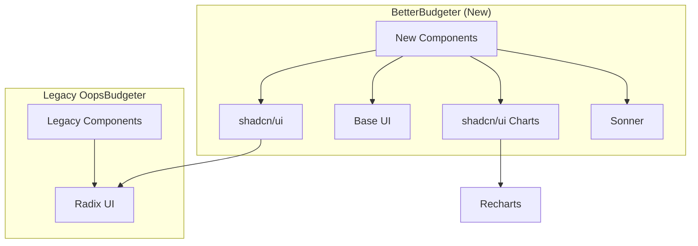

# Phase 4: Library Consolidation & Cleanup - Research

**Researched:** 2026-01-30
**Domain:** Technical debt cleanup, dependency management, documentation
**Confidence:** HIGH

## Summary

This phase focuses on completing the technical debt cleanup from the UI library migration (Phase 03) and establishing clear documentation for the library architecture. Research identified that the primary work involves:

1. **Tremor artifact cleanup** - Remove unused utility functions and update outdated comments
2. **Dependency audit** - Use depcheck to identify unused dependencies (mongoose, quick.db already flagged)
3. **Documentation creation** - Establish UI_ARCHITECTURE.md with Mermaid diagrams
4. **Sonner verification** - Confirm toast notification patterns work correctly

The codebase is already in good shape after Phase 03. The remaining work is cosmetic cleanup and documentation establishment.

**Primary recommendation:** Execute cleanup in order: (1) audit Tremor utilities for usage, (2) update comments, (3) run depcheck, (4) create docs/UI_ARCHITECTURE.md, (5) document Sonner patterns.

## Standard Stack

### Core Tools for This Phase

| Tool | Version | Purpose | Why Standard |
|------|---------|---------|--------------|
| depcheck | latest | Find unused dependencies | Industry standard for Node.js projects |
| bun | project default | Package management | Per CLAUDE.md requirements |

### Documentation Tools

| Tool | Purpose | Why Use |
|------|---------|---------|
| Mermaid | Architecture diagrams in markdown | GitHub/GitLab native rendering, no external tools needed |
| JSDoc | Code comments | Standard for JavaScript/TypeScript projects |

### Alternatives Considered

| Instead of | Could Use | Tradeoff |
|------------|-----------|----------|
| depcheck | npm-check-bun | npm-check-bun is fork for bun, but depcheck works fine with bunx |
| Mermaid | draw.io, Excalidraw | Mermaid is code-based, versioned with docs, no binary files |

**Installation:**
```bash
# depcheck runs via bunx, no install needed
bunx depcheck
```

## Architecture Patterns

### Documentation Structure Pattern

Based on existing docs/ folder conventions in this project:

```
docs/
├── UI_ARCHITECTURE.md         # NEW: Library responsibilities + diagrams
├── ARCHITECTURE_SKELETON.md   # Existing: Project architecture
├── BUDGET_STRATEGY.md         # Existing: Feature-specific
├── DASHBOARD_STRATEGY.md      # Existing: Feature-specific
└── ...
```

### UI_ARCHITECTURE.md Template

```markdown
# UI Library Architecture

## Library Responsibilities

| Library | Scope | Status |
|---------|-------|--------|
| shadcn/ui | All new BetterBudgeter components | ACTIVE |
| Base UI (@base-ui/react) | Headless primitives when shadcn/ui lacks coverage | AVAILABLE |
| Radix UI (@radix-ui/*) | Legacy OopsBudgeter only | FROZEN |
| Recharts (via shadcn/ui charts) | All new charts | ACTIVE |
| Sonner | Toast notifications | ACTIVE |

## Boundary Rules

[Copy from LIBRARY_STRATEGY.md]

## Visual Architecture



```

### Header Comment Pattern

For key files documenting library boundaries:

```typescript
/**
 * [Component/Module Name]
 *
 * [Brief description]
 *
 * LIBRARY USAGE:
 * - Uses shadcn/ui for UI primitives
 * - Uses Recharts (via shadcn/ui charts) for visualization
 *
 * EXTENSION POINT: [Optional - where future features could be added]
 *
 * @see docs/UI_ARCHITECTURE.md
 */
```

### Sonner Toast Pattern (Already Established)

```typescript
// Import from sonner package
import { toast } from "sonner";

// Basic usage patterns found in codebase:
toast.success("Success message");
toast.error("Error message");
toast.warning("Warning message");
toast.info("Info message");

// With custom options
toast.success("Message", {
  description: "Additional details",
  duration: 4000,
});
```

### Anti-Patterns to Avoid

- **Mixing library imports:** Never import @radix-ui directly in BetterBudgeter components
- **Inconsistent toast patterns:** Always use Sonner, never create custom toast implementations
- **Undocumented library decisions:** All boundary rules must be in UI_ARCHITECTURE.md

## Don't Hand-Roll

| Problem | Don't Build | Use Instead | Why |
|---------|-------------|-------------|-----|
| Dependency audit | Manual package.json review | depcheck via bunx | Catches transitive deps, handles special cases |
| Architecture diagrams | PNG/SVG images | Mermaid in markdown | Version controlled, GitHub renders natively |
| Focus ring styles | Custom CSS | Existing focusRing utility OR shadcn defaults | Already exists, consistent with design system |

**Key insight:** The Tremor utilities in utils.ts (`focusInput`, `focusRing`, `hasErrorInput`) are generic CSS class arrays that could be useful regardless of their Tremor origin. Research their usage before removing.

## Common Pitfalls

### Pitfall 1: Removing "Unused" Dependencies That Are Runtime-Required

**What goes wrong:** depcheck marks a dependency as unused, but it's actually used at runtime (e.g., peer dependencies, CLI tools, Tailwind plugins).

**Why it happens:** depcheck analyzes static imports but misses:
- Peer dependencies of other packages
- Dynamically loaded modules
- CSS/Tailwind plugins
- Runtime-only dependencies

**How to avoid:**
- Review depcheck output before removing anything
- For each "unused" dependency, grep the codebase and node_modules
- Check if it's a peer dependency of something else
- Test build after removal

**Warning signs:** Build fails with "cannot find module" after removing a "unused" dependency.

### Pitfall 2: Removing Utilities That Are Actually Used Indirectly

**What goes wrong:** Remove focusInput/focusRing utilities, then discover a component breaks.

**Why it happens:** Utilities may be spread via `cn()` or used in ways that aren't obvious from grep.

**How to avoid:**
1. Grep for exact utility names: `grep -r "focusInput" src/`
2. Grep for spread usage: `grep -r "...focusInput" src/`
3. If no usage found, remove and verify build

**Warning signs:** ESLint "unused variable" warnings, grep returning only definition.

### Pitfall 3: Outdated Comments Creating Confusion

**What goes wrong:** Comments say "Uses Tremor" when code uses Recharts, confusing future developers.

**Why it happens:** Comments weren't updated during migration.

**How to avoid:** Update ALL comments when changing implementations. Phase 03 verification already identified specific files.

**Warning signs:** Comments mentioning technologies that aren't in package.json.

### Pitfall 4: Incomplete Mermaid Diagram Testing

**What goes wrong:** Mermaid diagram has syntax error, renders as code block instead of diagram.

**Why it happens:** Mermaid syntax is strict, easy to have minor errors.

**How to avoid:**
- Test diagrams in [Mermaid Live Editor](https://mermaid.live) before committing
- Keep diagrams simple (flowchart TB, subgraph, arrows)
- Avoid special characters in labels

**Warning signs:** Triple backticks showing instead of rendered diagram.

## Code Examples

### depcheck Usage

```bash
# Source: depcheck npm documentation
# Run in project root
bunx depcheck

# Expected output format:
# Unused dependencies
# * mongoose
# * quick.db
#
# Unused devDependencies
# * @types/xyz
```

### Mermaid Flowchart Syntax

```mermaid
# Source: https://mermaid.js.org/syntax/flowchart.html
flowchart TB
    subgraph "Group Name"
        A[Component A]
        B[Component B]
    end

    A --> B
    B --> C[External]
```

### Tremor Utility Check Pattern

```bash
# Check if focusInput is used anywhere in src/
grep -r "focusInput" src/ --include="*.ts" --include="*.tsx"

# Expected output if unused:
# src/lib/utils.ts:export const focusInput = [...]
# (only the definition, no imports)
```

### JSDoc Header Comment

```typescript
// Source: WordPress JavaScript Documentation Standards
/**
 * Spending by Category Chart Component
 *
 * Displays a donut chart showing expense breakdown by category.
 *
 * LIBRARY USAGE:
 * - shadcn/ui ChartContainer for wrapper/theming
 * - Recharts PieChart for visualization
 * - @/utils/charts/CATEGORY_COLORS for consistent colors
 *
 * @see docs/UI_ARCHITECTURE.md for library decisions
 * @see docs/DASHBOARD_STRATEGY.md Section 4.2 for design rationale
 */
```

## State of the Art

| Old Approach | Current Approach | When Changed | Impact |
|--------------|------------------|--------------|--------|
| Tremor for charts | shadcn/ui + Recharts | Phase 03 | Better maintenance, consistent styling |
| Direct Radix imports | shadcn/ui wrappers | Phase 02 decision | Encapsulation, theming support |
| npm for packages | bun exclusively | Project start | Faster, per CLAUDE.md requirement |

**Deprecated/outdated:**
- **Tremor (@tremor/react):** Removed in Phase 03, any remaining references are artifacts
- **Direct Radix imports in new code:** Use shadcn/ui wrappers instead

## Specific Cleanup Items

### Files to Update (From Phase 03 Verification)

| File | Line | Current | Action |
|------|------|---------|--------|
| `src/lib/utils.ts` | 8-37 | Tremor utility exports | Check usage, remove or rename |
| `src/components/dashboard/index.ts` | 32 | "Uses Tremor for visualization" | Update to "Uses Recharts" |
| `src/utils/charts/index.ts` | 4 | "(Tremor/Recharts)" | Update to "(Recharts)" |
| `src/app/page.tsx` | 205 | "(Tremor Donut Chart)" | Update to "(Recharts PieChart)" |

### Utility Usage Research Result

```
Grep result for focusInput, focusRing, hasErrorInput:
- src/lib/utils.ts: definitions only
- No imports found elsewhere

Conclusion: These utilities are UNUSED and can be safely removed.
```

### Known Unused Dependencies (From CONCERNS.md)

| Dependency | Status | Action |
|------------|--------|--------|
| mongoose | Unused | Remove |
| quick.db | Unused | Remove |

## Sonner Integration Verification

### Current Integration Points

| Component | File | Usage Pattern |
|-----------|------|---------------|
| SyncTransactionsButton | src/components/dashboard/SyncTransactionsButton.tsx | toast.success/error/warning/info |
| BudgetSettings | src/components/settings/BudgetSettings.tsx | toast.success/error/info |
| LoginForm | src/components/auth/LoginForm.tsx | toast.success/error |
| SignOutButton | src/components/auth/SignOutButton.tsx | toast.success/error |
| BudgetContext | src/contexts/BudgetContext.tsx | toast.success (achievements) |
| NewTransaction | src/components/legacy/transactions/NewTransaction.tsx | toast.success/error |
| EditTransactionDialog | src/components/legacy/transactions/EditTransactionDialog.tsx | toast.success/error |
| DeleteTransactionDialog | src/components/legacy/transactions/DeleteTransactionDialog.tsx | toast.success |
| RecurringStatusDialog | src/components/legacy/transactions/RecurringStatusDialog.tsx | toast.success |
| api.ts | src/lib/api.ts | toast.error |

### Toaster Setup

- **Definition:** `src/components/ui/sonner.tsx` (shadcn/ui style)
- **Wrapper:** `src/components/legacy/effects/Sonner.tsx` (custom icons)
- **Mount point:** `src/app/layout.tsx` (line 91)

### Verification Approach

1. `bun run typecheck` - Verify no type errors in Sonner usage
2. `bun run build` - Verify production build succeeds
3. Code inspection - Verify consistent toast pattern usage

## Open Questions

### 1. Should focusInput/focusRing be kept as generic utilities?

**What we know:** These are CSS class arrays for focus states, generic enough to use without Tremor.

**What's unclear:** Whether shadcn/ui provides equivalent focus utilities that should be used instead.

**Recommendation:** Remove them since they're unused. If needed later, shadcn/ui has its own focus utilities via Tailwind.

### 2. Should planning docs (.planning/) also update Tremor references?

**What we know:** Context mentions updating planning docs to past tense.

**What's unclear:** How thorough this update should be (all 46 files found have "tremor" mentions).

**Recommendation:** Only update files that might be read going forward (ROADMAP.md, STATE.md, .continue-here.md files). Historical documents (SUMMARY.md files) can keep their original tense.

## Sources

### Primary (HIGH confidence)

- **Codebase inspection** - Direct examination of src/lib/utils.ts, src/components/*, package.json
- **Phase 03 Verification** - `.planning/phases/03-ui-library-migration/03-VERIFICATION.md`
- **CONCERNS.md** - `.planning/codebase/CONCERNS.md` for known unused deps

### Secondary (MEDIUM confidence)

- [depcheck npm documentation](https://www.npmjs.com/package/depcheck) - Dependency audit tooling
- [Sonner documentation](https://sonner.emilkowal.ski/) - Toast patterns
- [Mermaid flowchart syntax](https://mermaid.js.org/syntax/flowchart.html) - Diagram syntax

### Tertiary (LOW confidence)

- [JSDoc best practices](https://jsdoc.app/) - Documentation patterns (training data verified with official site)

## Metadata

**Confidence breakdown:**
- Tremor cleanup: HIGH - Direct codebase inspection, Phase 03 verification confirms items
- Dependency audit: HIGH - depcheck is standard tool, unused deps already flagged in CONCERNS.md
- Documentation patterns: HIGH - Existing docs/ folder provides template
- Sonner verification: HIGH - Direct codebase inspection confirms integration

**Research date:** 2026-01-30
**Valid until:** 60 days (cleanup patterns are stable, no fast-moving libraries involved)
