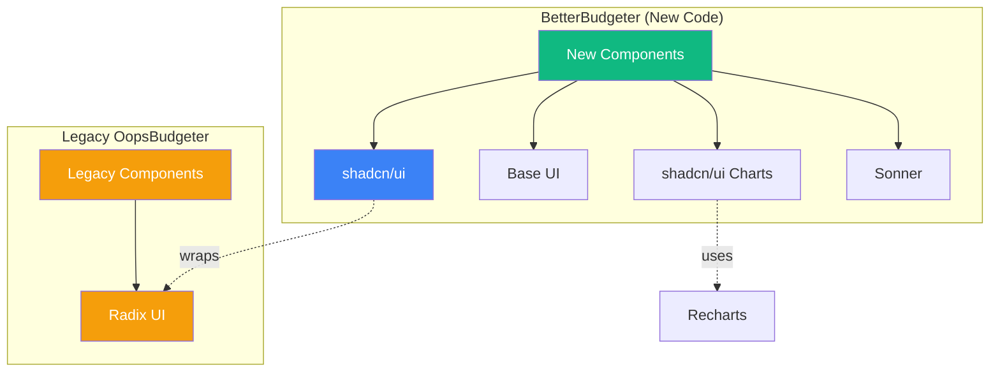

# UI Library Architecture

This document defines the UI library responsibilities and boundaries for BetterBudgeter.
For enforcement rules, see [CLAUDE.md](../CLAUDE.md) "UI Library Boundaries" section.

---

## Library Responsibilities

| Library | Scope | Status | When to Use |
|---------|-------|--------|-------------|
| shadcn/ui | All new BetterBudgeter components | ACTIVE | Default choice for new UI components |
| Base UI (@base-ui/react) | Headless primitives | AVAILABLE | When shadcn/ui lacks a needed primitive |
| Radix UI (@radix-ui/*) | Legacy OopsBudgeter only | FROZEN | Never for new code |
| Recharts (via shadcn/ui charts) | All new charts | ACTIVE | Any data visualization |
| Sonner | Toast notifications | ACTIVE | All user feedback toasts |

---

## Visual Architecture



---

## Boundary Rules

1. **BetterBudgeter components must NEVER import from `@radix-ui` directly**
2. **Legacy OopsBudgeter pages stay on Radix only - no shadcn/ui adoption**
3. **New charts must use shadcn/ui chart components (Recharts under the hood)**
4. **Base UI is only used when shadcn/ui does not provide the needed primitive**
5. **All toast notifications use Sonner - no custom implementations**

See [CLAUDE.md](../CLAUDE.md) "UI Library Boundaries" section for enforcement.

---

## Chart Color System

Charts use a consistent color palette defined in `src/utils/charts/index.ts`.

### CATEGORY_COLORS

Provides semantic colors for expense and income categories:

```typescript
import { CATEGORY_COLORS, getCategoryColor } from "@/utils/charts";

// Expense categories
CATEGORY_COLORS.Food        // "#ef4444" (red-500)
CATEGORY_COLORS.Rent        // "#f97316" (orange-500)
CATEGORY_COLORS.Utilities   // "#eab308" (yellow-500)
CATEGORY_COLORS.Transport   // "#22c55e" (green-500)
CATEGORY_COLORS.Entertainment // "#3b82f6" (blue-500)
CATEGORY_COLORS.Shopping    // "#8b5cf6" (violet-500)
CATEGORY_COLORS.Other       // "#6b7280" (gray-500)

// Income categories
CATEGORY_COLORS.Salary      // "#10b981" (emerald-500)
CATEGORY_COLORS.Freelance   // "#14b8a6" (teal-500)
CATEGORY_COLORS.Investment  // "#06b6d4" (cyan-500)
CATEGORY_COLORS.Bonus       // "#0ea5e9" (sky-500)
```

### Usage with Recharts

When using Recharts PieChart, apply colors per-slice using Cell components:

```tsx
import { PieChart, Pie, Cell } from "recharts";
import { CATEGORY_COLORS } from "@/utils/charts";

<Pie data={chartData} dataKey="value" nameKey="name">
  {chartData.map((entry, index) => (
    <Cell
      key={`cell-${index}`}
      fill={CATEGORY_COLORS[entry.name as keyof typeof CATEGORY_COLORS] || CATEGORY_COLORS.Other}
    />
  ))}
</Pie>
```

### Helper Functions

- `getCategoryColor(category: string)` - Returns color for a category, with fallback to "Other"
- `toPieChartData(breakdown)` - Transforms category breakdown to Recharts format with colors
- `formatAxisCurrency(value)` - Formats currency values for chart axes (e.g., "$1.5K")

---

## Sonner Toast Patterns

Sonner provides toast notifications throughout the application.

### Setup

The Toaster component is configured in `src/components/ui/sonner.tsx` and mounted in `src/app/layout.tsx`.

### Basic Usage

```typescript
import { toast } from "sonner";

// Success notification
toast.success("Transaction saved successfully");

// Error notification
toast.error("Failed to sync transactions");

// Warning notification
toast.warning("Some transactions may be duplicates");

// Info notification
toast.info("Syncing transactions...");
```

### With Description

```typescript
toast.success("Budget updated", {
  description: "Your Food category budget is now $500/month",
});

toast.error("Sync failed", {
  description: "Please check your connection and try again",
});
```

### Files Using Sonner

| Component | File | Usage |
|-----------|------|-------|
| SyncTransactionsButton | `src/components/dashboard/SyncTransactionsButton.tsx` | success/error/warning/info |
| BudgetSettings | `src/components/settings/BudgetSettings.tsx` | success/error/info |
| LoginForm | `src/components/auth/LoginForm.tsx` | success/error |
| SignOutButton | `src/components/auth/SignOutButton.tsx` | success/error |
| BudgetContext | `src/contexts/BudgetContext.tsx` | success (achievements) |
| NewTransaction | `src/components/legacy/transactions/NewTransaction.tsx` | success/error |
| EditTransactionDialog | `src/components/legacy/transactions/EditTransactionDialog.tsx` | success/error |
| DeleteTransactionDialog | `src/components/legacy/transactions/DeleteTransactionDialog.tsx` | success |
| RecurringStatusDialog | `src/components/legacy/transactions/RecurringStatusDialog.tsx` | success |
| api.ts | `src/lib/api.ts` | error |

---

## File Structure

### shadcn/ui Components

Located in `src/components/ui/`:

```
src/components/ui/
├── button.tsx
├── card.tsx
├── chart.tsx          # ChartContainer, ChartTooltip (wraps Recharts)
├── dialog.tsx
├── input.tsx
├── label.tsx
├── select.tsx
├── sonner.tsx         # Toaster configuration
├── table.tsx
└── ...
```

### BetterBudgeter Components

Located in `src/components/`:

```
src/components/
├── dashboard/
│   ├── SpendingByCategoryChart.tsx  # Uses shadcn/ui + Recharts
│   └── ...
├── settings/
│   └── BudgetSettings.tsx           # Uses shadcn/ui + Sonner
├── auth/
│   └── ...                          # Uses shadcn/ui + Sonner
└── ui/                              # shadcn/ui primitives
```

### Legacy OopsBudgeter Components

Located in `src/components/legacy/`:

```
src/components/legacy/
├── effects/
│   └── Sonner.tsx           # Custom Sonner icons (legacy wrapper)
├── transactions/
│   └── ...                  # Uses Radix UI
└── ...                      # All use Radix UI
```

---

## Decision Log

| Date | Decision | Rationale |
|------|----------|-----------|
| 2026-01-28 | Remove Tremor entirely | Unmaintained (no commits in 1+ year) |
| 2026-01-28 | Adopt shadcn/ui as primary | Copy/paste model, actively maintained |
| 2026-01-28 | Base UI for new primitives | Modern successor to Radix, v1.0 stable |
| 2026-01-30 | Freeze Radix for legacy only | Consistency with existing legacy code |
| 2026-01-30 | Pin Base UI to ^1.1.0 | Stable minor updates, avoid breaking changes |
| 2026-01-31 | Complete Tremor removal | All artifacts, CSS utilities, and references removed |

---

## Quick Reference

### "Which library do I use for...?"

| I need to... | Use | Example |
|--------------|-----|---------|
| Add a button | shadcn/ui | `import { Button } from "@/components/ui/button"` |
| Create a form input | shadcn/ui | `import { Input } from "@/components/ui/input"` |
| Build a dialog/modal | shadcn/ui | `import { Dialog } from "@/components/ui/dialog"` |
| Display a chart | shadcn/ui + Recharts | `import { ChartContainer } from "@/components/ui/chart"` |
| Show a notification | Sonner | `import { toast } from "sonner"` |
| Need a headless primitive shadcn/ui lacks | Base UI | `import { Combobox } from "@base-ui/react"` |
| Modify legacy OopsBudgeter code | Radix UI | (already in use, do not add new) |
